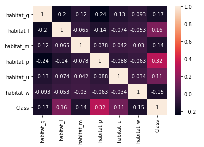

# Correlation Matrix
<p align="center"></p>

Feature Selection çalışmalarına Correlation Matrix ile devam ediyoruz. Veriye bakış açımız ve uyguladığımız her tekniğin bir istatistiksel altyapısı olması gerekir. Yapacağımız işlemlerin her birini model performansını artırmaya yönelik ve belirli bir sistematik ile yapmak başarımı en çok etkileyen unsurlardandır. Genel olarak featurelarımızın, target ile ilişkisini ölçmek için en popüler tekniklerden olan korelasyon matrisi bize basitçe kolonların birbiri ile olan ve hedef ile olan ilişkisini gösterir. Genel bir yaklaşım olarak "-0.7"den küçük ve "+0.7"den büyük korelasyon değerleri güçlü korelasyonu temsil etmektedir. Buradaki amacımız çıkış ile ilişkisi olmayan ve bilgi taşıma potansiyeli görece diğer kolonlara az olan featureları elemek olmalıdır. Bu sayede ilk derste verdiğimiz daha sade ve etkili model, hızlı eğitim gibi başarımı pozitif yönde etkileyecek unsurlara sahip olabilir. 

Şimdi python'da korelasyon matrisi nasıl oluşturulabilir buna bakalım. 

Geliştirici Notu:
Tüm kolonları ordinal olmayan kategorik verilerde korelasyon analizi mantıklı bir yaklaşım olup olmadığı tartışmaya açık bir konudur. Burada bahsi geçen veri seti veya amaçtan ziyade, korelasyon matrisinin tekniklerini ve anafikrini yakalama için uygun sayılabilir diyebiliriz. !! Genellikle !! regresyon işlemlerinizde ve sayısal bir değer içeren kolonlarda kullanılması şiddetle önerilir.

## Imports
```python
import pandas as pd 
from sklearn.preprocessing import LabelEncoder
from sklearn.preprocessing import StandardScaler
from sklearn.model_selection import train_test_split
```

Veri setini hazırlıkları yapmak adına içeri aktaralım.

```python
data = pd.read_csv("../mushrooms.csv")
data.shape
```

İlk yapacağımız işlem veri setimiz harflerden oluştuğu için bunu sayısal bir forma çevirmek olmalı, buradaki yaklaşımımız featureları one-hot encoding yaptıktan sonra standardize etmek. Y kolonumuzu label encoding yaparak korelasyon haritasını oluşturmak için featurlarımızın olduğu dataframe'in sonuna ekleyeceğiz.

```python
X = data.drop(['class'], axis=1)
y = data['class']
X_encoded = pd.get_dummies(X, prefix_sep="_")
y_encoded = LabelEncoder().fit_transform(y)
X_encoded["Class"] = y_encoded

X_encoded.corr()
```

Dataframe üzerinden bu verilerin okunması oldukça zor, seaborn kütüphanesindeki heatmap grafiği bizim için bu dağılımı renkler ve anlaşılması kolay bir görselle açıklayacak. Verisetimizin eğer tamamınız alırsak şu anki durumda 118 kolon var, bunun çizdirilmesi mantıkl değil, sadece son 7 kolonu alarak şu anlık gözlemleyelim. Birazdan öğreneceğimiz teknikler ile en önemli 10 parametreyi görselleştiriyor olacağız.

```python
sns.heatmap(X_encoded.iloc[:, -7:].corr(), annot=True)
```


Belirttiğimiz gibi eksi ve artı değerler güçlü korelasyonu ifade ediyor, burada sayının pozitif ve negatif olması ilişkinin ters veya doğru orantılı olarak değişmesi ile alakalı, her ikisi de bizim için iyi featurelar olabilir bu yüzden dataframe'in mutlak değerini alarak en yüksek değerli olanları getireceğiz.

```python
X_encoded.corr().abs()["Class"]

# .nlarget ile sıralı bir şekilde en yüksek 10 değeri alabiliriz.
X_encoded.corr().abs()["Class"].nlargest(10)
```

Bu zamana kadar yazdığımız kısmın sonunda index metodunu ekleyerek sadece kolon isimlerini istiyorum ve bunu ana datasetimizden başka bir değişkene aktarıyorum. Birazdan sadece bu kısmı kullanıyor olacağız, bu sayede daha okunaklı ve en yüksek 10 korelasyon değerine sahip kolon ile birlikte çalışıyor olacağız.

```python
X_reduced_col_names = X_encoded.corr().abs()["Class"].nlargest(10).index
X_encoded[X_reduced_col_names].corr()
```

Artık görselleştirme kısmına geçebiliriz. Çizdirdiğimiz görselin büyüklüğü ve çözünürlüğünü değiştirmek adına matplotlib kütüphanesini içeri aktarıyorum. figsize ile boyut, dpi ile çözünürülük ayarlanabilmektedir. heatmap içindeki "annot" ile karelerin içerisine değerlerini yazdırabiliyorum.

```python
import matplotlib.pyplot as plt

plt.figure(figsize=(10, 10), dpi=400)
sns.heatmap(X_encoded[X_reduced_col_names].corr().abs(), annot=True)
```

